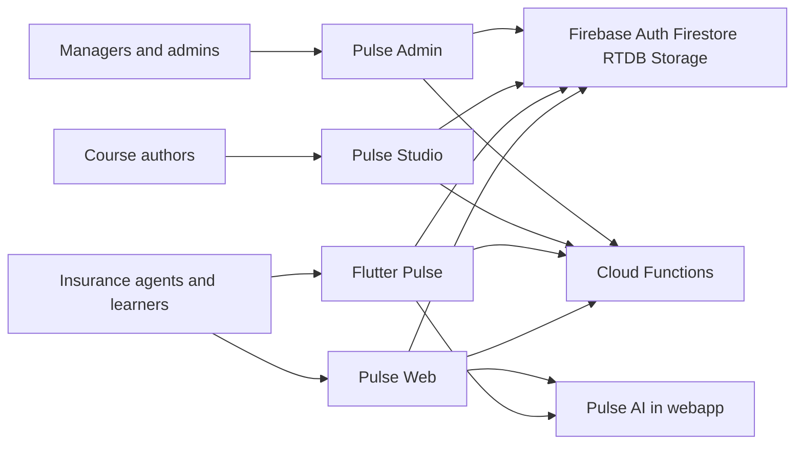

# Architecture

Pulse is a multi-client Firebase product: one identity and data plane, four UIs, privileged writes in Cloud Functions, and Pulse AI hosted in the learner webapp.

## Context (C4)

## Containers

| Container | Tech | Responsibility |
|-----------|------|----------------|
| Flutter app | Dart | Mobile forums, chats, Academy, AI, profile |
| webapp | Next.js 16 | Learner UX + Pulse AI API + SSO bridge |
| studio | Next.js 16 | Course/path authoring and review |
| admin | Next.js 16 | Approvals, users, org tree, insights |
| functions | Node 22 | Trusted callables, triggers, schedules |
| `@pulse/shared` | TypeScript + Zod | Domain contracts shared by TS surfaces |
| `@pulse/firebase-web` | TypeScript | Shared client Firebase repositories for Next apps |

## Trust boundaries

See [ADR-003](ADR-003-trusted-boundary.md). Summary:

- **Client + security rules** — reads and simple writes the user is allowed to own.
- **Cloud Functions** — votes, role/approval, org mutations, quiz grading, group create, SSO, account lifecycle, support-AI posts.
- **Next.js AI routes** — RAG generation with Admin SDK; not a substitute for Functions for privileged community writes.

## ADRs

| ADR | Topic |
|-----|-------|
| [ADR-001](ADR-001-monorepo-tooling.md) | pnpm workspaces + Turborepo |
| [ADR-002](ADR-002-shared-domain.md) | Shared domain with Zod |
| [ADR-003](ADR-003-trusted-boundary.md) | Rules vs Functions vs Next API |
| [ADR-004](ADR-004-pulse-ai.md) | Pulse AI bounded context |
| [ADR-005](ADR-005-security-ops.md) | App Check, CORS, ops checklist |

Also: [data-model.md](data-model.md), [environments.md](environments.md), [flutter-di.md](flutter-di.md).
