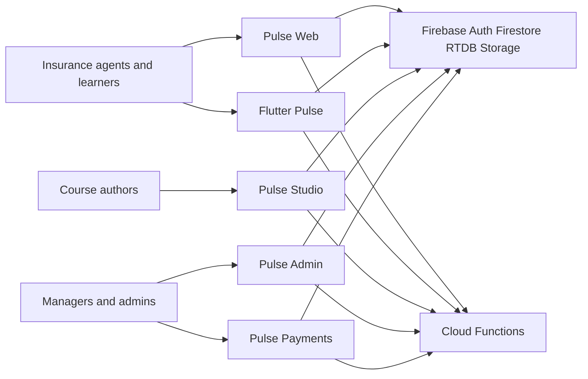

# Architecture

Pulse is a multi-client Firebase product: one identity and data plane, four UIs, and privileged writes in Cloud Functions.

## Monorepo layout

```text
apps/web          @pulse/web       learner Next.js
apps/studio       @pulse/studio    course authoring
apps/admin        @pulse/admin     ops portal
apps/payments     @pulse/payments  ACA override management
apps/functions    @pulse/functions Cloud Functions
apps/mobile       every_benefits   Flutter
packages/shared   @pulse/shared
packages/firebase-web
packages/eslint-config
packages/typescript-config
tooling/scripts
```

## Context (C4)



## Containers

| Container | Tech | Responsibility |
|-----------|------|----------------|
| Flutter app | Dart (`apps/mobile`) | Mobile forums, chats, Academy, profile |
| web | Next.js 16 | Learner UX + **auth hub** (login/account + SSO bridge) |
| studio | Next.js 16 | Course/path authoring and review |
| admin | Next.js 16 | Approvals, users, org tree, insights |
| payments | Next.js 16 | ACA override management, statements, reconciliation |
| functions | Node 24 | Trusted callables, triggers, schedules |
| `@pulse/shared` | TypeScript + Zod | Domain contracts shared by TS surfaces |
| `@pulse/firebase-web` | TypeScript | Shared client Firebase repositories for Next apps |

## Trust boundaries

See [ADR-003](ADR-003-trusted-boundary.md).

## ADRs

| ADR | Topic |
|-----|-------|
| [ADR-001](ADR-001-monorepo-tooling.md) | pnpm workspaces + Turborepo (`apps/` + `packages/`) |
| [ADR-002](ADR-002-shared-domain.md) | Shared domain with Zod |
| [ADR-003](ADR-003-trusted-boundary.md) | Rules vs Functions vs Next API |
| [ADR-005](ADR-005-security-ops.md) | App Check, CORS, ops checklist |
| [ADR-006](ADR-006-auth-hub.md) | Pulse auth hub; Firebase IdP; `@pulse/sso` protocol |
| [ADR-007](ADR-007-payments-overrides.md) | Payments app + override distribution domain |

Also: [data-model.md](data-model.md), [creator-analytics.md](creator-analytics.md), [environments.md](environments.md), [flutter-di.md](flutter-di.md).
